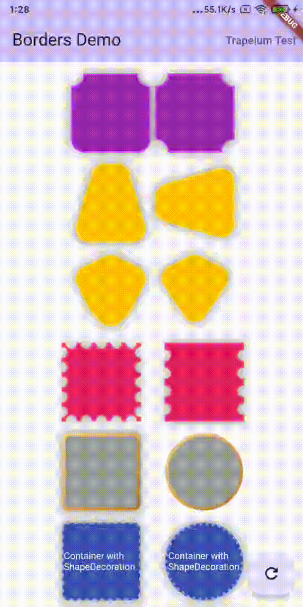

Borders
===================================
<a href="https://pub.dev/packages/borders">
    
</a>

Custom ShapeBorders like Chamfer Border,Trapezium border supported Animated.

## Features

- ✅ ChamferBorder
- ✅ TrapeziumBorder
- ✅ StampBorder
- ✅ GradientBorder
- 🚧 More custom Borders

## Preview

|Borders| |
|:-:|:-:|
|| |

## Getting started

`flutter pub add borders`

## Usage

```dart
Container(
    width: 100,
    height: 100,
    decoration: ShapeDecoration(
        shape: ChamferBorder(
            borderRadius: BorderRadius.circular(16),
            borderChamfer: BorderChamfer.vertical(
                top: true,
            ),
        ),
    ),
);
```

More usage see [/example](example/) folder.

